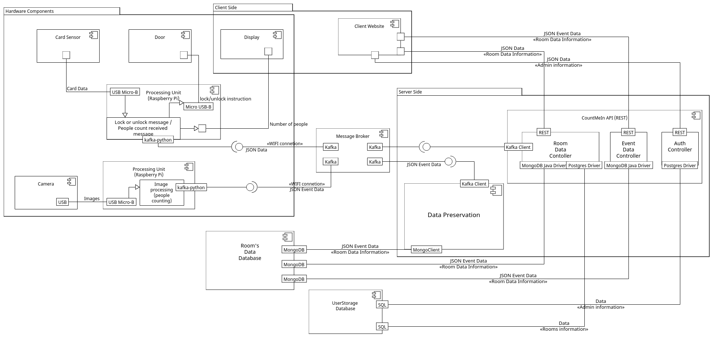

# IES_CountMeIn

Group 5's project for IES. Count Me In, is an automatic sensor service that controls the number of people inside a room.

## Members of the group

| Nmec   | Name                | Email                       | Github                                                      | Roles         |
| ------ | ------------------- | --------------------------- | ----------------------------------------------------------- | ------------- |
| 107849 | Alexandre Cotorobai | <alexandrecotorobai@ua.pt>  | [AlexandreCotorobai](https://github.com/AlexandreCotorobai) | Team Manager  |
| 108215 | Hugo Correia        | <hf.correia@ua.pt>          | [MrLoydHD](https://github.com/MrLoydHD)                     | Product Owner |
| 109089 | Joaquim Rosa        | <joaquimvr15@ua.pt>         | [JakeRosa](https://github.com/JakeRosa)                     | Architect     |
| 108073 | Bernardo Figueiredo | <bernardo.figueiredo@ua.pt> | [LeikRad](https://github.com/LeikRad)                       | DevOps Master |

## Repository Overview

| Directory                                                                                                                                                     | Language(s)      | Description                                                                                                                                                                                                                                    |
| ------------------------------------------------------------------------------------------------------------------------------------------------------------- | ---------------- | ---------------------------------------------------------------------------------------------------------------------------------------------------------------------------------------------------------------------------------------------- |
| [IES_CountMeIn/proj_CameraController](https://github.com/LeikRad/IES_CountMeIn/tree/69b1ebb4b51b462dbb9d48b3c67b79bdc23797c8/proj_CameraController)           | Python           | Directory where simulated room data is generated and published to Kafka.                                                                                                                                                                       |
| [IES_CountMeIn/proj_CountMeIn/backend](https://github.com/LeikRad/IES_CountMeIn/tree/69b1ebb4b51b462dbb9d48b3c67b79bdc23797c8/proj_CountMeIn/backend)         | Spring Boot Java | Contains the Spring Boot project used for developing our project's API.                                                                                                                                                                        | [IES_CountMeIn/proj_CountMeIn/backend](https://github.com/LeikRad/IES_CountMeIn/tree/69b1ebb4b51b462dbb9d48b3c67b79bdc23797c8/proj_CountMeIn/backend) | Spring Boot Java | Contains the Spring Boot project used for developing our project's API. |
| [IES_CountMeIn/proj_CountMeIn/frontend](https://github.com/LeikRad/IES_CountMeIn/tree/69b1ebb4b51b462dbb9d48b3c67b79bdc23797c8/proj_CountMeIn/frontend)       | React TypeScript | Contains the client interface code that displays data obtained through API calls.                                                                                                                                                              |
| [IES_CountMeIn/proj_CountMeIn/init_db](https://github.com/LeikRad/IES_CountMeIn/tree/69b1ebb4b51b462dbb9d48b3c67b79bdc23797c8/proj_CountMeIn/init_db)         | Python           | Contains the code that initializes the SQL database with persistent data for admins and their rooms.                                                                                                                                           |
| [IES_CountMeIn/proj_CountMeIn/proxy](https://github.com/LeikRad/IES_CountMeIn/tree/69b1ebb4b51b462dbb9d48b3c67b79bdc23797c8/proj_CountMeIn/proxy)             |                  | Contains the Nginx configuration file that sets up a web server acting as a reverse proxy.                                                                                                                                                     |
| [IES_CountMeIn/proj_CountMeIn/services](https://github.com/LeikRad/IES_CountMeIn/tree/69b1ebb4b51b462dbb9d48b3c67b79bdc23797c8/proj_CountMeIn/services)       | Python           | Contains the code for the service that connects messages about room capacity between the Message Broker and the MongoDB Database.                                                                                                              |
| [IES_CountMeIn/proj_DisplayLockController](https://github.com/LeikRad/IES_CountMeIn/tree/69b1ebb4b51b462dbb9d48b3c67b79bdc23797c8/proj_DisplayLockController) | Python, Bash     | In this directory, the code is responsible for managing the display of information related to room occupancy. It connects to a Kafka server to receive real-time updates on room occupancy and displays this information on a 16x2 LCD screen. |

## Architecture

- **Processing Unit (Camera):** Receives images from the Camera, processes the image by counting the number of people present, and sends a JSON message to the Message Broker containing the room ID, current occupancy, and the current date.

- **Processing Unit (Display):** Receives messages from the Message Broker to lock or unlock the Door or to change the current or maximum occupancy displayed on the Display.

- **Data Preservation:** The component responsible for receiving and storing messages from the Message Broker, which are then inserted into the Room's Data Database.

- **CountMeIn API:** The API responsible for providing endpoints for authenticating administrators and retrieving/updating information about the rooms they manage.

- **Room Data Database:** This database stores the historical events that have occurred in each room over time.

- **UserStorage Database:** The database responsible for storing persistent information about administrators and their corresponding rooms.

- **Message Broker:** Facilitates the transmission of messages between the Camera Processing Unit and the Data Preservation component, conveying events that have occurred. Additionally, it handles communication between the API and the Display Processing Unit, providing updates on door lock status or maximum room capacity. Lastly, it manages communication between the Camera Processing Unit and the Display Processing Unit for real-time updates on the current capacity.

- **Client Website:** A website that displays both the real-time status and historical data of rooms accessible to a specific administrator, achieved through calls to the CountMeIn API.
 
## Bookmarks

### Project Resources

- [Github Repository](https://github.com/LeikRad/IES_CountMeIn)

- [Backlog](https://github.com/users/LeikRad/projects/2)
- [Board](https://github.com/users/LeikRad/projects/2/views/2)
- [Milestones](https://github.com/users/LeikRad/projects/2/views/4)

### Reports

- [Editable Product Specification Report](https://docs.google.com/document/d/1DLN441DW_DaQnTAU9D2JchCNytAL9wR9nkcMuMj6qkw/edit?usp=sharing)

- [UX Preview of CountMeIn](https://www.figma.com/file/CBGdvUVIvI0YjEOeBxCDpW/CountMeIn?type=design&node-id=6%3A5&mode=design&t=xh7WXl9CRVFXzweF-1)

### Previews

